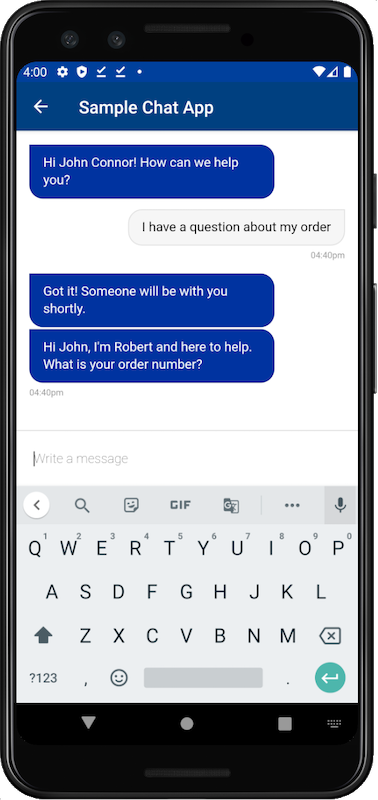

# Gladly Sidekick SDK

The Gladly Android SDK makes it quick and easy to build a messaging experience in your Android app. We provide powerful and customizable UI screens and elements that can be used out-of-the-box to connect with your users.

## Documentation
API documentation can be found at [https://developer.gladly.com/android-sdk/](https://developer.gladly.com/android-sdk/)

## Example application
To get an idea of how to work with the SDK an example application can be found [here](https://github.com/gladly/sidekick-ios-sdk/tree/master/Example).
1. Clone this repository.
1. Open the Example project in Android Studio
1. Download the latest SDK release and place it in `app/libs` directory.
1. Open the `GladlyChatUtils.kt` file and replace the `APP_ID` value with a value given to you by Gladly.

## Dependencies
For the SDK to function as expected there are a few dependencies that needs to be pulled in. You can find them defined in the example applications [build.gradle](https://github.com/gladly/sidekick-android-sdk/blob/master/Example/app/build.gradle) file.

## Releases
Releases of the SDK can be found under the [releases](https://github.com/gladly/sidekick-android-sdk/releases) tab.

## Licence
[See license](https://github.com/gladly/sidekick-android-sdk/tree/master/LICENSE.md)
